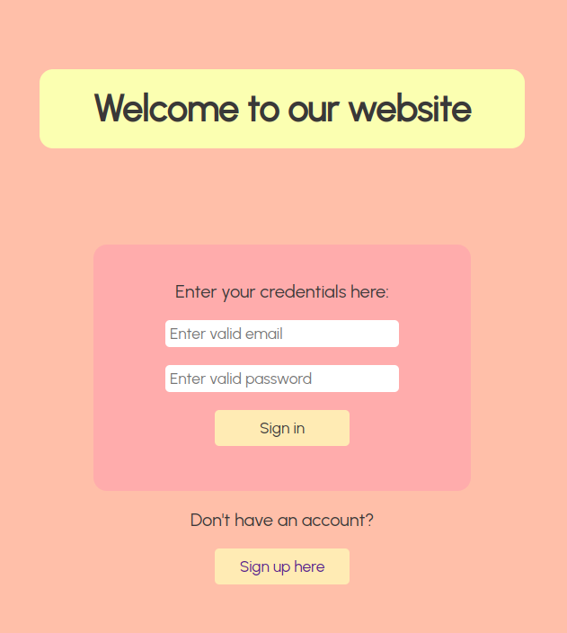

# faker-app

## Table of Contents

- [Introduction](#introduction)
- [Faker-app Developers](#faker-app-developers)
- [Features](#features)
- [Requirements](#requirements)
- [Usage](#usage)
- [Technologies Used](#technologies-used)
- [Design](#design)
- [Project Structure](#project-structure)
- [Screenshot](#screenshot)

## Introduction
This is a full stack demo website where you can sign up, log in, visualize data fetched from faker api and log out. All data is stored in MongoDB.

## Faker-app Developers
- [Elena Armaroli](https://github.com/elenarmaroli). This is an invidual project, fully designed and developed by me. 

## Features
- Sign up with validation for all fields: first name, last name, email and password
- Log in with validation, login is saved in localStorage
- Log out
- Display of user card filled in with data fetched from faker.js
- Nav bar
- Footer

## Requirements
- npm install
- react
- react-router-dom
- nodemon
- cors
- express
- express-validator
- mongoose
- mongoDB atlas
- faker-js

## Usage
- To run client side: npm start
- Access the application at `http://localhost:3000/`
- To run the server side: nodemon app.js

## Technologies Used
- React.js
- CSS
- Express.js
- Node.js
- MongoDB
- mongoose
- cors
- faker-js
- npm 

## Design
The website was fully designed by me. 
I used Figma for the design and chose a color palette and font.

## Project Structure
- `backEnd/`: Contains the backend Express.js code.
- `fronEnd/faker-app`: Contains the React.js frontend code.

## Screenshot
Here, you can see the sleek and user-friendly interface. The side-bar menu moves to the top on a mobile device, providing a smooth and enjoyable user experience.

